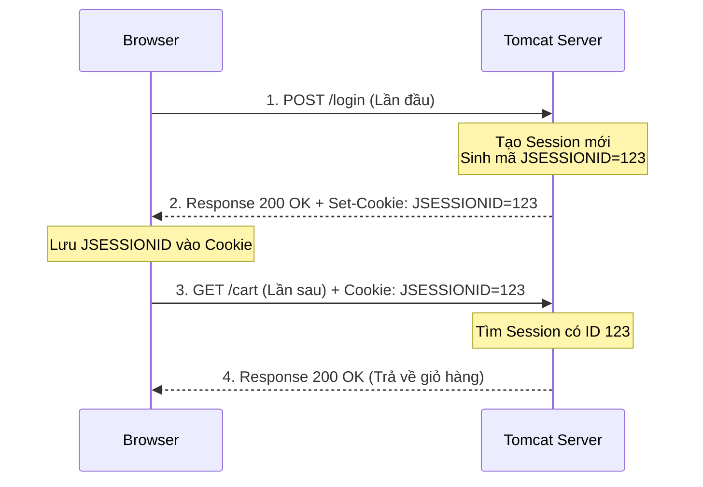

# Bản chất của Session (Phiên làm việc)

### 1. Tại sao lại cần Session?
Bản thân giao thức HTTP là một giao thức **Stateless (Không trạng thái/Não cá vàng)**. Có nghĩa là nếu bạn gửi Request 1 (Đăng nhập), Server biết bạn là Vy. Nhưng 2 giây sau bạn gửi Request 2 (Xem giỏ hàng), Server lại hỏi: *"Ủa anh là ai vậy?"*.

Để giải quyết căn bệnh mất trí nhớ này, **Session** (Phiên làm việc) ra đời. Nó giúp Server "nhớ mặt" từng trình duyệt một cách xuyên suốt qua nhiều Request khác nhau.


> [!NOTE] note
> - JSESSIONID được lưu ở Cookie (Trình duyệt người dùng) và tự động đính kèm request khi gửi lên Server.
> - <mark style="background:#d3f8b6">Cất dữ liệu vào túi Session (Lưu trên RAM Server)  </mark>
> 	- Hàm HttpSession session = req.getSession();  
> 	- session.setAttribute("LOGGED_IN_USER", username);
> - <mark style="background:#d3f8b6">Tạo cookie mới để lưu vào trình duyệt người dùng</mark>
> 	- Cookie myCookie = new Cookie("user_theme", "dark_mode");
> 	- myCookie.setMaxAge(7 * 24 * 60 * 60); // Sống được 7 ngày (tính bằng Giây)
> 	- myCookie.setHttpOnly(true);           // BẢO MẬT TỐI THƯỢNG: Cấm mã độc Javascript (XSS) đọc trộm Cookie này
> 	- myCookie.setPath("/");                // Cookie có hiệu lực ở mọi đường dẫn của Website
> 	- resp.addCookie(myCookie);


### 2. Cơ chế hoạt động ngầm (Sự kết hợp giữa Session và Cookie)

Nhiều người lầm tưởng Session và Cookie là 2 kẻ thù, nhưng thực tế **Session sống được là nhờ Cookie**.

1. **Lần đầu gặp gỡ:** Trình duyệt gửi Request tới Server. Server thấy khách mới, liền tạo ra một cái "Tủ đồ" (Session) trên bộ nhớ RAM của Server. 
2. **Cấp thẻ tủ đồ (`JSESSIONID`):** Server đặt cho tủ đồ này một mã số ngẫu nhiên cực dài (vd: `JSESSIONID=ABC123XYZ`). Sau đó Server nhét cái mã này vào một cái **Cookie** và gửi về cho Trình duyệt cất giữ.
3. **Lần sau quay lại:** Những lần Trình duyệt gửi Request tiếp theo, nó sẽ **tự động** mang theo cái Cookie chứa `JSESSIONID` kia lên Server.
4. **Nhận diện:** Server đọc mã `JSESSIONID`, tìm lại đúng cái tủ đồ cũ trên RAM, và mở ra xem bạn đã cất gì trong đó (Giỏ hàng, Thông tin Đăng nhập).



---

### 3. Cách code Session trong Java Servlet

Làm việc với Session cực kỳ đơn giản vì Servlet đã giấu hết những thứ phức tạp (như tạo Cookie hay sinh ID) xuống bên dưới.

**1. Lấy (hoặc Tạo mới) Session**
```java
// Nếu đã có Session thì lấy ra xài, nếu chưa có thì Server tự tạo mới 1 cái
HttpSession session = request.getSession();

// Lấy mã JSESSIONID ra xem thử (ít dùng)
String id = session.getId(); 
```

**2. Đăng nhập (Cất đồ vào tủ)**
```java
session.setAttribute("username", "Vy");
session.setAttribute("role", "ADMIN");
```

**3. Kiểm tra quyền (Lấy đồ từ tủ)**
```java
// Ép kiểu vì getAttribute luôn trả về Object
String user = (String) session.getAttribute("username"); 

if (user == null) {
    response.sendRedirect("/login"); // Đá ra ngoài vì chưa đăng nhập
}
```

**4. Đăng xuất (Đốt tủ đồ)**
```java
// Hủy diệt hoàn toàn Session (Xóa sạch mọi thuộc tính bên trong)
session.invalidate(); 
```

**5. Cài đặt thời gian sống (Timeout)**
```java
// Nếu trong 30 phút khách không có bất kỳ tương tác nào, tự động hủy Session
session.setMaxInactiveInterval(30 * 60); // Tính bằng Giây
```
*(Thường sẽ được cấu hình chung cho cả dự án trong file `web.xml`)*

---

### 4. Cạm bẫy "Sập Server" (OutOfMemory)
Vì Session được lưu hoàn toàn trên **RAM của Server**. Nếu lúc cao điểm có 10.000 user đang online, nghĩa là có 10.000 cái Session nằm trên RAM. 
> [!WARNING] Luật Sinh Tồn
> - **Chỉ lưu những thứ cực kỳ nhỏ và quan trọng** vào Session (như `userId`, `username`, `role`).
> - **Tuyệt đối không** lôi cả cục dữ liệu khổng lồ (Ví dụ: Danh sách 1000 sản phẩm) nhét vào Session. RAM Server sẽ quá tải và sập toàn bộ hệ thống!

---

### 5. Phụ lục: So sánh Cookie và Local Storage (Câu hỏi Phỏng vấn)

Khi lập trình Frontend (React/Vue/JS thuần) kết hợp với Backend REST API, chúng ta có 2 nơi lưu trữ dữ liệu phổ biến ở phía Trình duyệt (Client) là **Cookie** và **Local Storage**.

| Tiêu chí | Cookie | Local Storage |
| :--- | :--- | :--- |
| **Dung lượng tối đa** | Rất nhỏ (~4KB) | Lớn hơn rất nhiều (~5MB) |
| **Gửi lên Server** | **Tự động** đính kèm vào mọi Request HTTP bay lên Server. | **Không tự động**. Frontend phải tự dùng code lấy ra và nhét vào Header (VD: `Bearer Token`). |
| **Thời gian sống** | Chết khi đóng trình duyệt (nếu là Session Cookie) hoặc sống tới ngày `Max-Age` được set. | Sống vĩnh viễn cho tới khi dùng Javascript gọi lệnh `localStorage.clear()` hoặc user tự xóa. |
| **Tính Bảo mật (XSS)** | Cực kỳ an toàn nếu set cờ `HttpOnly`. Hacker chạy mã độc Javascript cũng **không thể** đọc trộm được Cookie. | Kém an toàn. Mọi mã độc Javascript chạy trên trang web đều có thể tự do đọc được dữ liệu trong này. |
| **Chống giả mạo (CSRF)** | Dễ bị tấn công CSRF (Vì Browser *luôn luôn tự động* gửi Cookie mà không thắc mắc). | Khá an toàn trước CSRF (Vì trình duyệt không tự động gửi đi). |
| **Ai quản lý?** | Thường do Server chi phối thông qua lệnh `Set-Cookie`. | Chỉ do Frontend (Javascript) kiểm soát. |

> [!TIP] Kinh nghiệm thực chiến: Nên dùng cái nào?
> - **Nên dùng Cookie (nhớ bật cờ `HttpOnly`)**: Để lưu trữ các thông tin cực kỳ nhạy cảm như mã `JSESSIONID` hoặc **Refresh Token** (JWT) để chống hacker chôm chỉa.
> - **Nên dùng Local Storage**: Để lưu các thiết lập giao diện UI (Dark/Light mode, ngôn ngữ), giỏ hàng vãng lai (chưa đăng nhập), hoặc **Access Token** (loại sống ngắn 15 phút).


# Code ví dụ

khi bạn gọi đoạn code `req.getSession().getAttribute("LOGGED_IN_USER")`, Tomcat (Server) đang âm thầm làm 3 bước sau ở hậu trường:

1. **Tìm chìa khóa trong Request:** Bản thân cái `request` mà trình duyệt gửi lên **KHÔNG HỀ CHỨA** dữ liệu `"LOGGED_IN_USER"`. Nó chỉ mang theo một cái Cookie có chứa mã số chìa khóa (ví dụ: `JSESSIONID=123ABC...`).
2. **Lục lọi trong RAM:** Khi bạn gọi `req.getSession()`, Tomcat sẽ đọc cái chìa khóa `JSESSIONID` đó. Sau đó, nó chạy vào **bộ nhớ RAM** của Server (nơi nó đang cất giữ hàng ngàn cái tủ đồ của hàng ngàn khách hàng khác nhau), để dò tìm xem cái tủ đồ nào khớp với mã số `123ABC...` kia.
3. **Mở tủ lấy đồ:** Khi đã tìm trúng cái tủ đồ (Session Object) trên RAM, hàm `.getAttribute("LOGGED_IN_USER")` sẽ mở tủ ra và lấy giá trị đưa cho bạn.

```java
package org.example.servlet.session;  
  
import jakarta.servlet.ServletException;  
import jakarta.servlet.annotation.WebServlet;  
import jakarta.servlet.http.HttpServlet;  
import jakarta.servlet.http.HttpServletRequest;  
import jakarta.servlet.http.HttpServletResponse;  
import jakarta.servlet.http.HttpSession;  
  
import java.io.IOException;  
  
@WebServlet("/api/session/*")  
public class SessionDemoServlet extends HttpServlet {  
  
    @Override  
    protected void doGet(HttpServletRequest req, HttpServletResponse resp) throws ServletException, IOException {  
        req.setCharacterEncoding("UTF-8");  
        resp.setContentType("application/json;charset=UTF-8");  
  
        String path = req.getPathInfo(); // Lấy đoạn URL phía sau /api/session/  
        if (path == null) {  
            resp.getWriter().print("{\"message\": \"Vui lòng gọi /login, /profile hoặc /logout\"}");  
            return;  
        }  
        
        System.out.println("SessionID: " + req.getSession().getId() + " " + req.getSession().getAttribute("LOGGED_IN_USER"));
  
        switch (path) {  
            case "/login":  
                handleLogin(req, resp);  
                break;  
            case "/profile":  
                handleProfile(req, resp);  
                break;  
            case "/logout":  
                handleLogout(req, resp);  
                break;  
            default:  
                resp.setStatus(404);  
                resp.getWriter().print("{\"message\": \"API không tồn tại\"}");  
        }  
    }  
  
    // 1. ĐĂNG NHẬP (TẠO SESSION VÀ CẤT ĐỒ VÀO TỦ)  
    private void handleLogin(HttpServletRequest req, HttpServletResponse resp) throws IOException {  
        String username = req.getParameter("username");  
        if (username == null || username.isBlank()) {  
            resp.setStatus(400);  
            resp.getWriter().print("{\"message\": \"Thiếu param ?username=...\"}");  
            return;  
        }  
  
        // Lấy Session hiện tại (Hoặc tạo mới nếu chưa có)  
        HttpSession session = req.getSession();  
          
        // Cất dữ liệu vào túi Session  
        session.setAttribute("LOGGED_IN_USER", username);  
          
        // Cài đặt Session chết sau 30 phút (1800 giây)  
        session.setMaxInactiveInterval(1800);  
  
        resp.getWriter().printf("{\"message\": \"Đăng nhập thành công!\", \"jsessionid_sinh_ra\": \"%s\"}", session.getId());  
    }  
  
    // 2. XEM HỒ SƠ (KIỂM TRA SESSION CÒN SỐNG HAY KHÔNG)  
    private void handleProfile(HttpServletRequest req, HttpServletResponse resp) throws IOException {  
        // Lấy Session hiện tại (KHÔNG TẠO MỚI nếu chưa có bằng cách truyền false)  
        // Dùng false để check xem user có mang thẻ JSESSIONID hợp lệ lên không        HttpSession session = req.getSession(false);  
  
        if (session == null || session.getAttribute("LOGGED_IN_USER") == null) {  
            // Không có Session hoặc trong Session không có dữ liệu -> Chưa đăng nhập  
            resp.setStatus(401);  
            resp.getWriter().print("{\"message\": \"Cửa đóng! Bạn chưa đăng nhập.\"}");  
            return;  
        }  
  
        // Đã có Session hợp lệ, lấy dữ liệu ra  
        String user = (String) session.getAttribute("LOGGED_IN_USER");  
        resp.getWriter().printf("{\"message\": \"Xin chào %s. Cửa đã mở!\"}", user);  
    }  
  
    // 3. ĐĂNG XUẤT (ĐỐT TỦ ĐỒ)  
    private void handleLogout(HttpServletRequest req, HttpServletResponse resp) throws IOException {  
        HttpSession session = req.getSession(false);  
        if (session != null) {  
            // Hủy diệt hoàn toàn Session trên RAM Server  
            session.invalidate();  
        }  
        resp.getWriter().print("{\"message\": \"Đã đăng xuất và hủy Session thành công!\"}");  
    }  
}
```


# Xem kết quả

![[10. Session và Cookie-1786274547782.webp]]