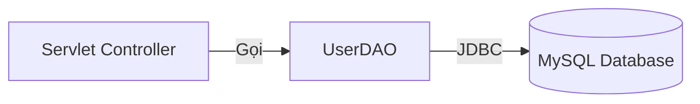

# Kết nối Database bằng JDBC (Java Database Connectivity)

JDBC là bộ thư viện tiêu chuẩn (API) của Java dùng để nói chuyện với bất kỳ cơ sở dữ liệu quan hệ nào (MySQL, PostgreSQL, SQL Server,...).

---

### 1. Kiến trúc kết nối
Vì Java muốn làm bạn với tất cả các Database, nên nó sinh ra mô hình "cắm Driver":
1. **Java App** của bạn gọi hàm của Java (Giao diện chuẩn).
2. Tùy thuộc vào loại Database đang dùng, bạn gắn cái **JDBC Driver** tương ứng vào (Ví dụ: `mysql-connector-java.jar`).
3. Driver sẽ tự lo việc dịch lệnh của Java thành ngôn ngữ mà Database đó hiểu.

---

### 2. Mô hình Data Access Object (DAO)
Tuyệt đối KHÔNG viết code kết nối Database trực tiếp trong Servlet (Controller). Servlet chỉ lo điều hướng. Logic truy xuất Database phải được tách riêng ra một nơi gọi là **DAO Pattern**.

**Ưu điểm của DAO:** Code cực kỳ sạch sẽ, dễ bảo trì, và tái sử dụng được ở khắp nơi.



---

### 3. Ví dụ Code chuẩn (CRUD)

#### Bước 1: Khởi tạo Connection (Dùng chung)
```java
// UserDAO.java
public class UserDAO {
    private String url = "jdbc:mysql://localhost:3306/mydb";
    private String user = "root";
    private String password = "password";
    
    private Connection getConnection() throws SQLException {
        // Load Driver (Không bắt buộc với Java đời mới)
        try { Class.forName("com.mysql.cj.jdbc.Driver"); } catch(Exception e) {}
        
        return DriverManager.getConnection(url, user, password);
    }
}
```

#### Bước 2: Lấy dữ liệu (SELECT)
Luôn luôn đóng Connection sau khi xài xong bằng khối `try-with-resources` hoặc `finally`.
```java
public User findById(int id) {
    String sql = "SELECT * FROM users WHERE id = ?";
    
    // Tự động đóng connection khi ra khỏi khối try
    try (Connection conn = getConnection();
         PreparedStatement pstmt = conn.prepareStatement(sql)) {
         
        // Set tham số chống SQL Injection
        pstmt.setInt(1, id);
        
        // Nhận kết quả
        try (ResultSet rs = pstmt.executeQuery()) {
            if (rs.next()) {
                User u = new User();
                u.setId(rs.getInt("id"));
                u.setName(rs.getString("name"));
                return u;
            }
        }
    } catch (SQLException e) {
        e.printStackTrace();
    }
    return null;
}
```

#### Bước 3: Thêm dữ liệu (INSERT)
Với INSERT/UPDATE/DELETE, ta dùng `executeUpdate()`. Hàm này trả về số dòng bị ảnh hưởng (số nguyên).
```java
public boolean insert(User user) {
    String sql = "INSERT INTO users (name, email) VALUES (?, ?)";
    
    try (Connection conn = getConnection();
         PreparedStatement pstmt = conn.prepareStatement(sql)) {
         
        pstmt.setString(1, user.getName());
        pstmt.setString(2, user.getEmail());
        
        // Trả về số dòng thêm thành công
        int rows = pstmt.executeUpdate();
        return rows > 0;
        
    } catch (SQLException e) {
        e.printStackTrace();
    }
    return false;
}
```

---

> [!CAUTION] Cảnh báo Đỏ: SQL Injection
> Nếu bạn viết truy vấn bằng cách nối chuỗi: `String sql = "SELECT * FROM users WHERE name = '" + name + "'";` 
> 👉 Hacker có thể truyền `name = "' OR 1=1 --"` để ăn cắp toàn bộ dữ liệu.
>
> **Giải pháp BẮT BUỘC:** LUÔN LUÔN sử dụng `PreparedStatement` với các dấu hỏi chấm `?` như trong ví dụ trên. Trình biên dịch sẽ tự động mã hóa chuỗi để chống SQL Injection.
