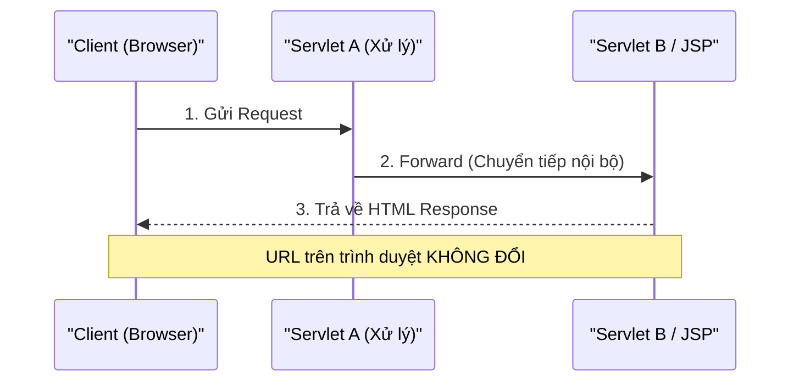

# Bản chất của Forward (Chuyển tiếp nội bộ)

### 1. Cơ chế hoạt động

- **Forward** là hành động: *"Cầm nguyên gói Request hiện tại, truyền sang cho một thành phần khác (JSP hoặc Servlet) xử lý tiếp"*.
- Diễn ra **hoàn toàn nội bộ bên trong Server** (Tomcat).
- Vì phải duy trì gói `Request` nên API bắt nguồn từ: `req.getRequestDispatcher("/...").forward(req, resp)`.
- Client (Trình duyệt) **hoàn toàn không biết** sự chuyển giao này.



### 2. Code Demo Thực Tế

```java
@WebServlet("/demo-forward")
public class ForwardDemoServlet extends HttpServlet {
    @Override
    protected void doGet(HttpServletRequest req, HttpServletResponse resp) throws ServletException, IOException {
        // 1. Cất dữ liệu vào Request Scope
        req.setAttribute("secretData", "Món quà từ Forward (Đích nhận được)");

        // 2. Chuyển tiếp sang trang đích (URL trên trình duyệt giữ nguyên /demo-forward)
        req.getRequestDispatcher("/target.jsp").forward(req, resp);
    }
}
```
