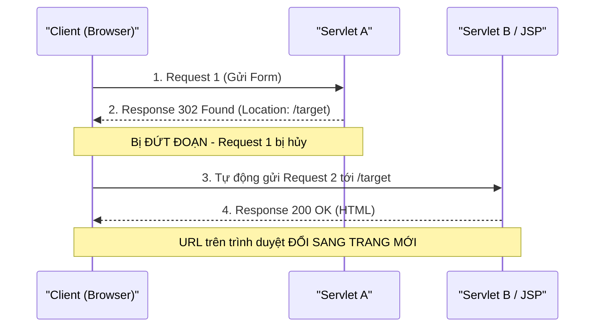
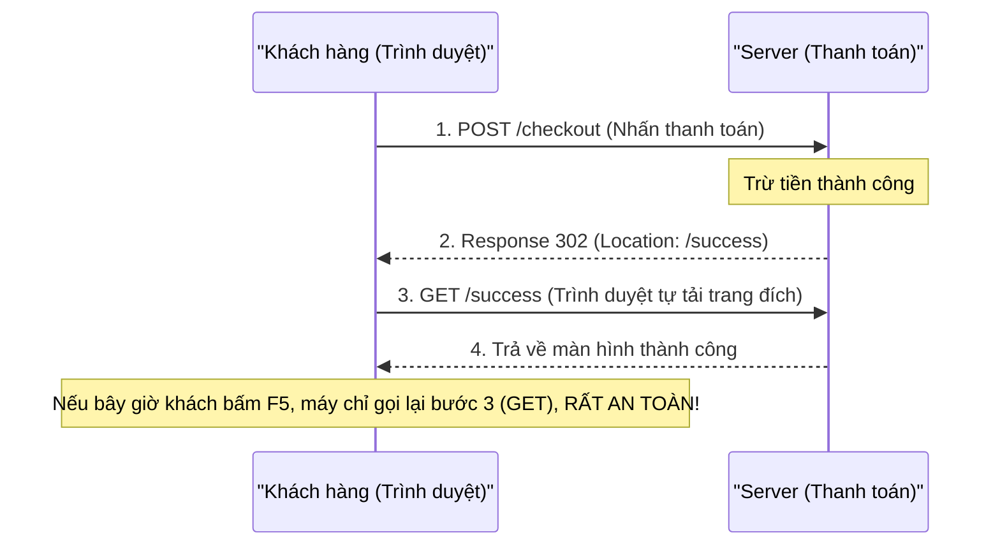
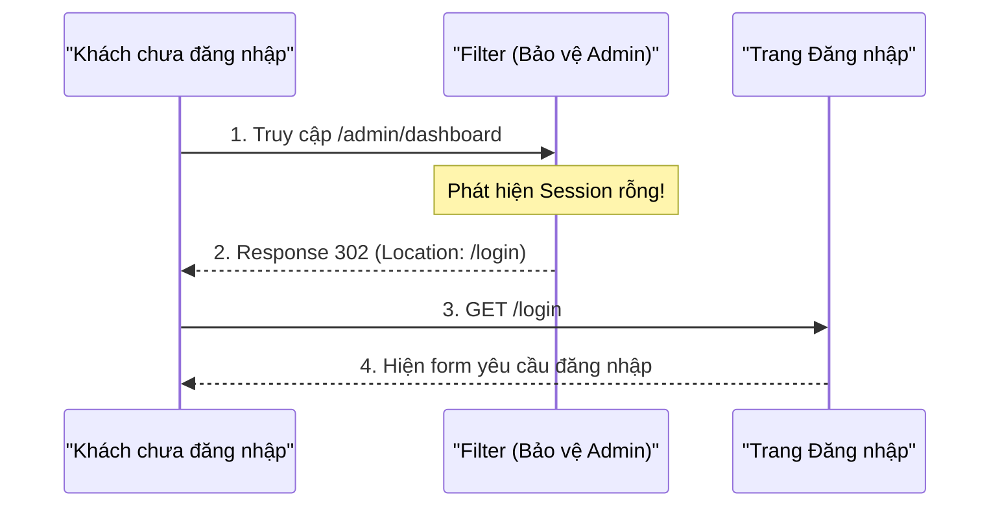
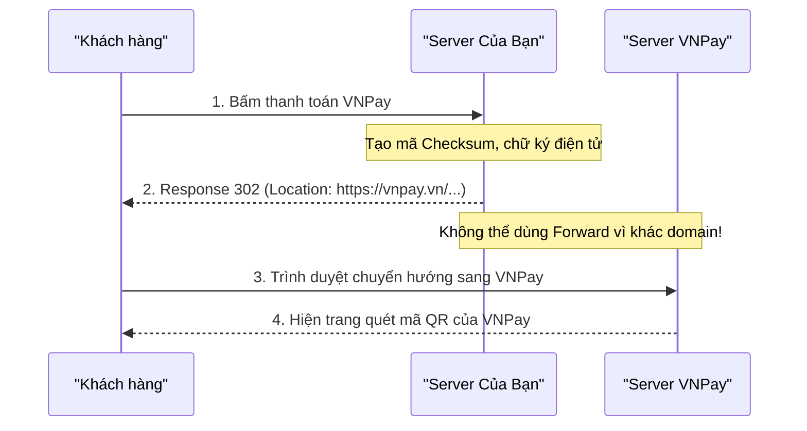

# Bản chất của SendRedirect (Chuyển hướng trình duyệt)

### 1. Cơ chế hoạt động

- **Redirect** là hành động: *"Tôi không xử lý nội bộ nữa, tôi trả lời ngay lập tức về cho trình duyệt một câu lệnh điều hướng"*.
- Nó gửi một gói tin Response về trình duyệt với mã **302 Found** kèm header `Location: <url mới>`. Trình duyệt sẽ tự động gửi một Request thứ 2 đến URL mới.
- Vì bản chất là "Đáp trả cho Client", API bắt nguồn từ: `resp.sendRedirect("/...")`.



### 2. Code Demo Thực Tế

```java
@WebServlet("/demo-redirect")
public class RedirectDemoServlet extends HttpServlet {
    @Override
    protected void doGet(HttpServletRequest req, HttpServletResponse resp) throws ServletException, IOException {
        // 1. Cất dữ liệu vào Request số 1
        req.setAttribute("secretData", "Sẽ bị mất sạch vì sinh ra Request mới!");

        // 2. Ép trình duyệt tự chuyển hướng
        // (Bắt buộc cộng contextPath để tránh lỗi 404 nếu nhảy ra root domain)
        resp.sendRedirect(req.getContextPath() + "/demo-forward");
    }
}
```

---

### 3. Ứng dụng thực tế: Bắt buộc phải dùng SendRedirect khi nào?

Trong thực tế doanh nghiệp, có **3 kịch bản kinh điển** mà bạn tuyệt đối không được dùng `Forward`, bắt buộc phải dùng `SendRedirect`:

#### Kịch bản 1: Mô hình PRG (Post / Redirect / Get) - Chống Submit Form 2 lần



- **Nghiệp vụ:** Khách hàng bấm nút "Thanh toán" hoặc "Submit Đơn hàng" (phương thức POST).
- **Vấn đề nếu dùng Forward:** Sau khi trừ tiền xong, nếu dùng Forward thì trang kết quả (URL và Method) vẫn giữ nguyên là POST. Nếu khách hàng vô tình bấm `F5` (Refresh) trình duyệt $\rightarrow$ Trình duyệt hiện bảng cảnh báo *"Confirm Form Resubmission"* và tự động gửi lại Request POST $\rightarrow$ **Khách bị trừ tiền 2 lần, sinh ra 2 đơn hàng trùng lặp!**
- **Cách giải quyết:** Ngay sau khi xử lý POST (ghi Database/trừ tiền) thành công, Server dùng `sendRedirect("/thanh-cong")` để ép trình duyệt tạo một Request mới (phương thức GET). Kể từ lúc này, khách có spam nút F5 cả ngày thì cũng chỉ là load lại trang hiển thị "Thành công", không hề bị submit lại form.

#### Kịch bản 2: Bảo mật & Xác thực (Authentication)



- **Nghiệp vụ:** Người dùng cố tình gõ URL truy cập vào khu vực cấm như `/admin/dashboard` khi chưa đăng nhập.
- **Cách giải quyết:** Hệ thống (Filter/Servlet) kiểm tra `session` thấy rỗng, lập tức gọi `resp.sendRedirect("/login")` để "đá văng" người đó về thẳng giao diện Đăng nhập. Điều tương tự cũng áp dụng khi người dùng bấm **Đăng xuất**: Sau khi xóa Session, hệ thống sẽ Redirect họ về Trang chủ.

#### Kịch bản 3: Tích hợp Cổng thanh toán bên thứ 3 (Cross-domain)



- **Nghiệp vụ:** Khách hàng chọn phương thức thanh toán VNPay hoặc MoMo.
- **Vấn đề:** Giao diện quét mã QR không nằm trên Server của bạn, mà nằm ở Server của đối tác (VD: `https://vnpay.vn/checkout/...`).
- **Cách giải quyết:** Cơ chế `Forward` chỉ có thể luân chuyển nội bộ bên trong cùng một Server (Tomcat) của bạn, nó bất lực trong việc điều hướng sang một Server khác. Do đó, bạn bắt buộc phải dùng `sendRedirect("https://vnpay.vn/...")` để đưa khách hàng sang hệ thống của đối tác.

